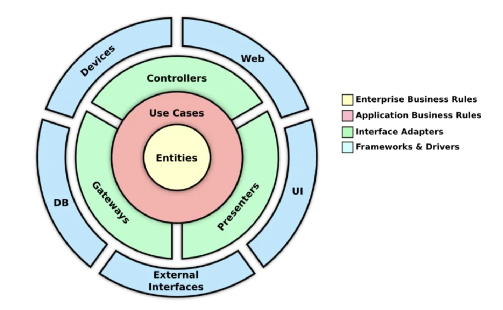

# SimU-GameService

This repository contains code for the backend implementation of the Sim-U project.

## Running the server

*Note*: To run the server, you will need to have the [.NET Core SDK](https://dotnet.microsoft.com/download) installed on your machine. The server is built using the ASP.NET Core framework, and the SDK is required to build and run the application.

- Run `dotnet restore src` to restore the package dependencies.
- Run `dotnet build --no-restore src` to build the application.
- Run `dotnet run --project src/SimU-GameService.Api` to launch the application.
- For the last step, you can alternatively run `dotnet watch run --project src/SimU-GameService.Api` to launch the Swagger UI and API documentation. This will also enable hot-reloading, so the server will restart automatically when you make changes to the code.

## Code structure

The code in this repository is structured to follow the [Clean Architecture](https://blog.cleancoder.com/uncle-bob/2012/08/13/the-clean-architecture.html) paradigm. This software architecture pattern promotes separation of concerns, testability, and independence from frameworks and libraries. The architecture is designed to be adaptable to changing requirements and technologies, and to facilitate testing and code maintenance. It uses layers to separate the core business logic from technical details and allows for flexibility and maintainability. The key idea is that code dependencies point inward. This means that code in the innermost layer should have no dependencies on code in the outermost layers. Dependencies on code in the same layer or code in the inner layers is allowed. The layers in the diagram below map to the ASP.NET Core projects in this repo as follows:

| Layer | Project | Diagram layer |
| -------- | -------- | -------- |
| Domain | [Domain](src/SimU-GameService.Domain/) | Entity (yellow) |
| Application | [Application](src/SimU-GameService.Application/) | Use Cases (pink) |
| Presentation | [Api](src/SimU-GameService.Api/), [Contracts](src/SimU-GameService.Contracts/), [Infrastructure](src/SimU-GameService.Infrastructure/) | Controllers & Presenters (green) |

## [Domain](src/SimU-GameService.Domain/)

Contains the code for the core logic of the game service. For example, the `User` class (model & methods) resides here. This project contains the code for the core components of the game that are unlikely to change as the project grows.

## [Application](src/SimU-GameService.Application/)

Contains the logic for application use cases. For example, the logic for an action such as authenticating a user into the game resides here. In this example, we might need to access the database to check and persist changes. To maintain the rule that prohibits code from inner layers from depending on outer components, we define abstractions/interfaces that specify behavior we expect from outer components in this layer, and write the implementations in the outer layer, following the *dependency inversion principle*. This allows us to swap out the implementation of the database without changing the application layer.

### [Infrastructure](src/SimU-GameService.Infrastructure/)

This project contains the code that handles our application's infrastructure. An example is the database logic. The benefit of Clean Architecture is that we can swap the database provider or change how we access the database as need demands without breaking the rest of the application, since the inner components are only aware of the interface provided by the code in this layer, and not the actual implementation.

### [Contracts](src/SimU-GameService.Contracts/)

This is a simple class library that defines the shared *data transfer objects* (DTO) for the WebAPI. The requests define the structure of the data objects that the API expects from clients, whereas the responses define the data models sent back. This library can be thought of as an extension of the WebAPI.

### [API](src/SimU-GameService.Api/)

This is the application's interface with the Unity frontend. It contains the controllers and SignalR hub to route requests reaching the API endpoints to the correct services in the application layer and package the output into the appropriate response.
